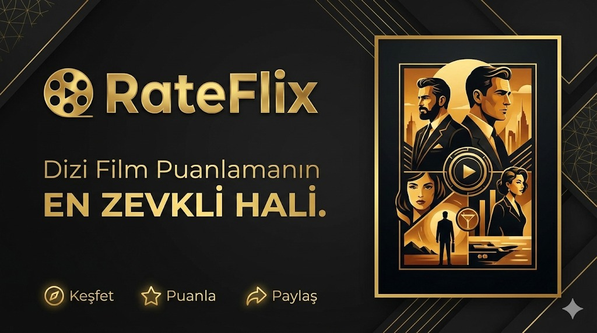

# RATEFLİX

> **Not:** Bu bölüm proje adı ile güncellenmelidir.

---

## Proje Hakkında

**Proje Tanımı:** 

**Örnek:** RateFlix, sinemaseverlerin izledikleri film ve dizileri kayıt altında tutabildiği, kişisel listeler oluşturup içerikleri puanlayabildiği kapsamlı bir sosyal keşif platformudur. Kullanıcıların tür bazlı filtreleme ve popüler içerik takibi ile yeni yapımlar keşfetmesini sağlarken, topluluk yorumları ve favori listeleri aracılığıyla interaktif bir deneyim sunmayı hedefler. Temelde bir "sinefil ajandası" işlevi görerek, her kullanıcının kendi dijital film arşivini yönetmesine olanak tanır.

**Proje Kategorisi:** 
> Film,dizi puanlama 

**Referans Uygulama:** 
> [Örnek Referans Uygulama](https://letterboxd.com)

---

## Proje Linkleri

- **REST API Adresi:** [api.yazmuh.com](https://api.yazmuh.com)
- **Web Frontend Adresi:** [frontend.yazmuh.com](https://frontend.yazmuh.com)

---

## Proje Ekibi

**Grup Adı:** 
> LoSiento
**Ekip Üyeleri:** 
- Mahmut Kesen
- Aytuğ Avni Akay

---

## Dokümantasyon

Proje dokümantasyonuna aşağıdaki linklerden erişebilirsiniz:

1. [Gereksinim Analizi](Gereksinim-Analizi.md)
2. [REST API Tasarımı](API-Tasarimi.md)
3. [REST API](Rest-API.md)
4. [Web Front-End](WebFrontEnd.md)
5. [Mobil Front-End](MobilFrontEnd.md)
6. [Mobil Backend](MobilBackEnd.md)
7. [Video Sunum](Sunum.md)

---